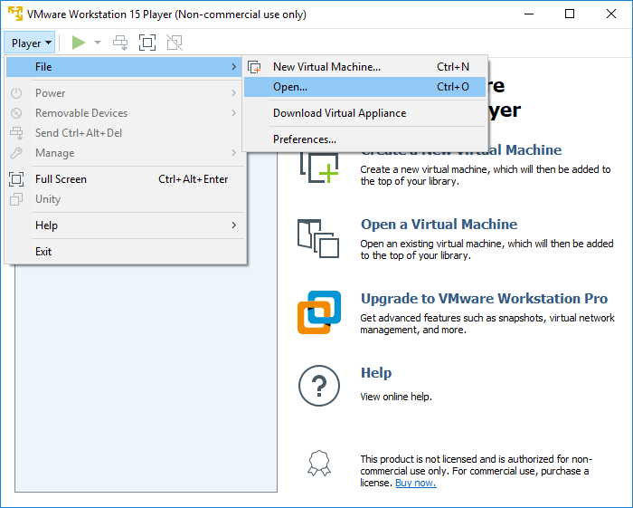
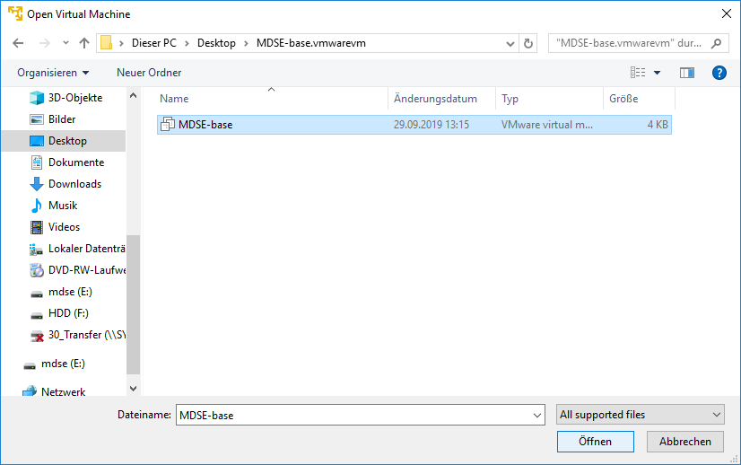
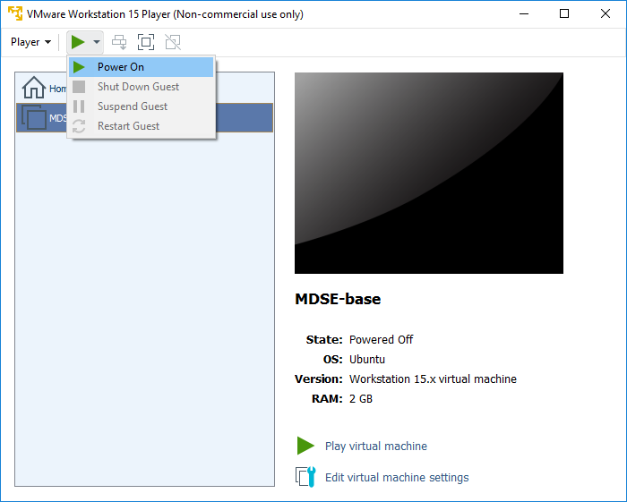
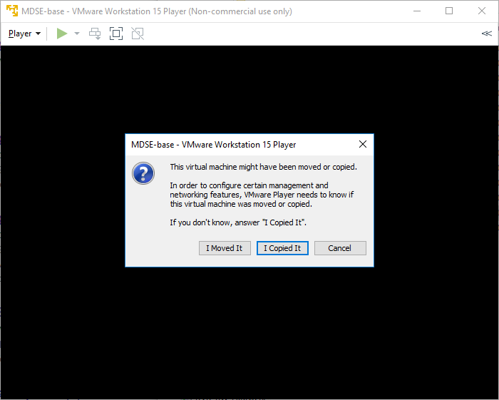
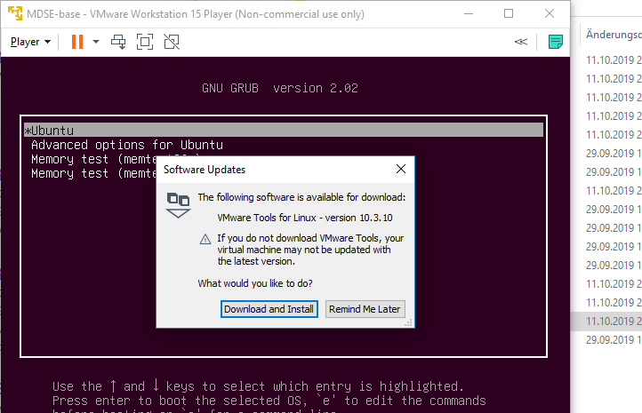
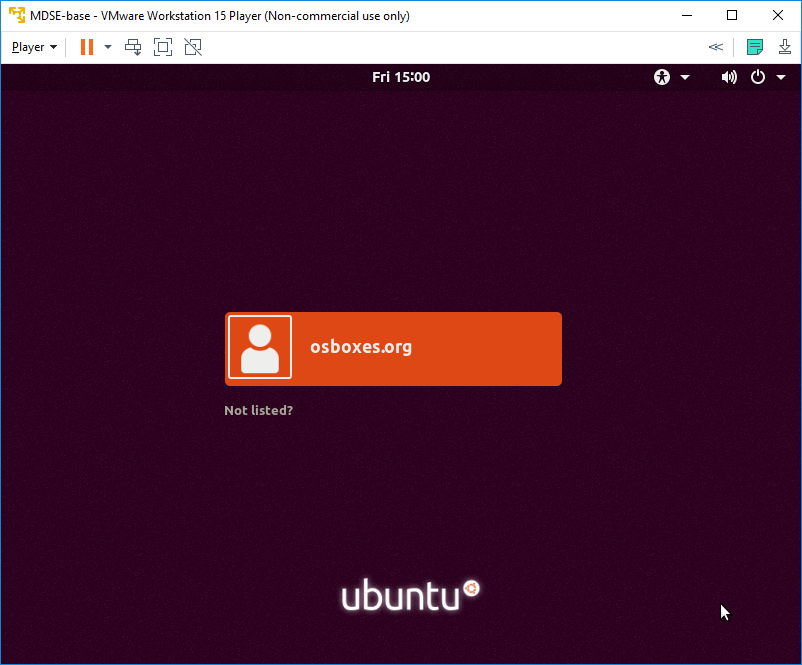

# Übung 1: Vorbereiten der Umgebung

1. Dateien vom USB Stick in einen lokalen Ordner kopieren
2. Winrar installieren um die TGZ Datei zu entpacken
3. TGZ Datei entpacken
4. VMWare Workstation installieren

## Starten der Virtual Machine
1. Starten des VMware Players. Öffnen des VM Image file
	

2. Auswählen des entpackten VM Image.

3. Starten der VM

4. "I Copied It" auswählen

5. "Download and Install" auswählen

***Herzlichen Glückwunsch!***

Sie sollten nun ein funktionstüchtiges Ubuntu Linux haben. Das password zum Anmelden finden Sie auf der Tafel.
