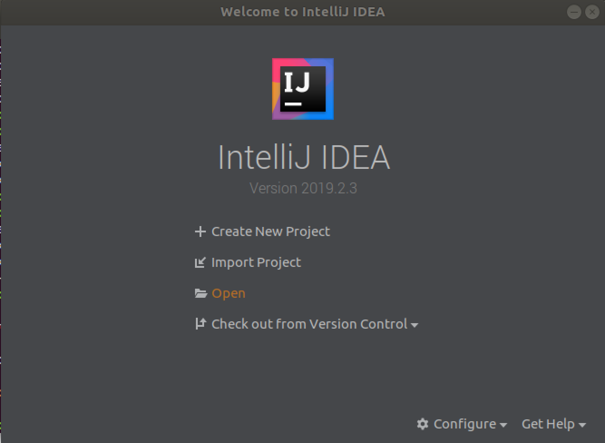
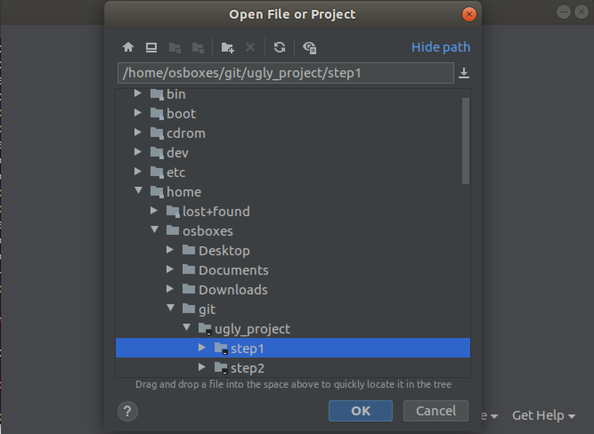

# Übung 1 Intellij

### Voraussetzung
* GIT 
* Java JDK installiert + JAVA_HOME gesetzt
* Idea Intellij

### Aufgabe
1. Nutzen Sie `git` und clonen Sie das [PatrikSteuer/ugly_project](https://github.com/PatrikSteuer/ugly_project) von github.
  2. Öffnen Sie den enthaltenen Ordner **step1** als Intellij Projekt. Wählen Sie dazu **File > Open** aus 
   
  
  3. Öffnen Sie die App Klasse, diese befindet sich in `src/main/java/com/dhbw/mdse/ugly_project/App.java`. 
  4. Führen Sie die Klasse manuel aus. Betrachten Sie das Ergebnis 

##### Refactoring
1. Öffnen Sie die App Klasse
2. Formatieren Sie die Klasse (STRG+ALT+L/CONTROL+OPTION+L)
3. Ersetzen Sie die Werte durch Variablen, Hint: Rechtsklick 
4. Nutzen Sie Refactoring um bestehenden Code in eine Methode auszulagern. Überlegen Sie was sinnig ist. 
5. Führen Sie zusätzliche Berechnungen für die Werte 12 und 4 durch.

##### Bibliothek
1. Suchen Sie nach der Klasse *MathFunctions*. Durch zweimaliges drücken der **Shift** Taste öffnet sich die Suche. 
  2. Ersetzen Sie die Berechnungen der **App** Klasse mit den Methoden der **MathFunctions** Klasse. 
   ```
MathFunctions funcs = new MathFunctions();
int subtraction = funcs.subtract(20,5);
   ```
  3. Führen Sie die **App** Klasse erneut aus
  

##### Maven
In der Toolbar an der rechten Seite sehen Sie *Maven Projects*

1. Öffnen Sie die *Maven Projects*.
2. Führen Sie den Lifecycle Package aus. Dazu öffnen Sie zunächst den Lifecycle Reiter und markieren dann "package". Dann klicken Sie auf den grünen ⇒ der innerhalb der sich innerhalb der Maven Project Toolbar befindet.
3. Überprüfen Sie das Ergebnis das im Terminal der IDE angezeigt wird.
4. Öffnen Sie den *target* Ordner. Dort sollte sich eine jar Datei befinden.
5. Die entstandene jar Datei können Sie nun in einem beliebigen Terminal ausführen. Nutzen Sie dafür 
```
ugly_project\step1\target>java -jar ugly_project_step1-1.0-SNAPSHOT.jar
```


