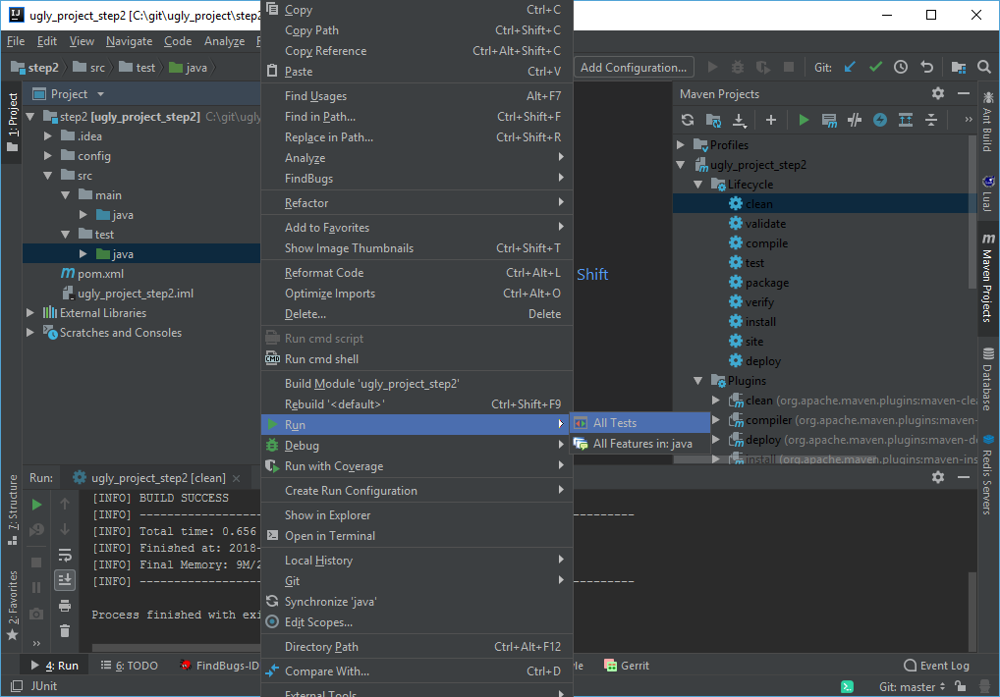

# Übung 2 Intellij + Check Style + Java Docs + JUnit

# Voraussetzung:
* GIT 
* Java JDK installiert + JAVA_HOME gesetzt
* Idea Intellij
* [PatrikSteuer/ugly_project](https://github.com/PatrikSteuer/ugly_project) ausgecheckt
* Step2 des ugly_projects als IDEA Intellij Projekt geöffnet

### Site und JUnit
Erstellen Sie die Maven Reports:

1. Führen Sie die Lifecycle *package* und *site* aus.
2. Rechtsklick auf die Datei *target/site/jacoco/index.html*.
3. Open in Browser
3. Finden Sie ungetestete Methoden der Klasse MathFunctions.
4. Erstellen Sie zusätzliche Tests sodass alle Methoden getestet werden.

### JUnit und IntelliJ
Sie können Ihre JUnit Tests direkt in IntelliJ ausführen:

1. Gehen Sie auf *src>test>java*. 
2. Rechtsklick auf *java*
3. *Run>All Tests*

*Info: Sie können den Debug Modus nutzen um Fehler zu analysieren.*

### Code Style
Importieren Sie die Settings zur Code Formatierung in Ihre IDE:

1. Öffnen Sie die Settings *STRG+ALT+S* / *CONTROL+SHIFT+A*
2. Editor > Code Style 
3. Klicken Sie auf  *Import Scheme > Intellij IDEA code style xml*
4. Wählen Sie die Datei *step2/config/codestyle/intellij-java-google-style.xml* aus
5. Klicken Sie auf Ok.

### Checkstyle + Java Docs
1. Analysieren Sie den Checkstyle Report in *site/checkstyle.html*.
2. Beheben Sie die Fehler der MathFunctions Klasse.

